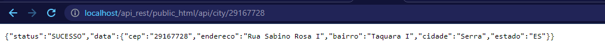
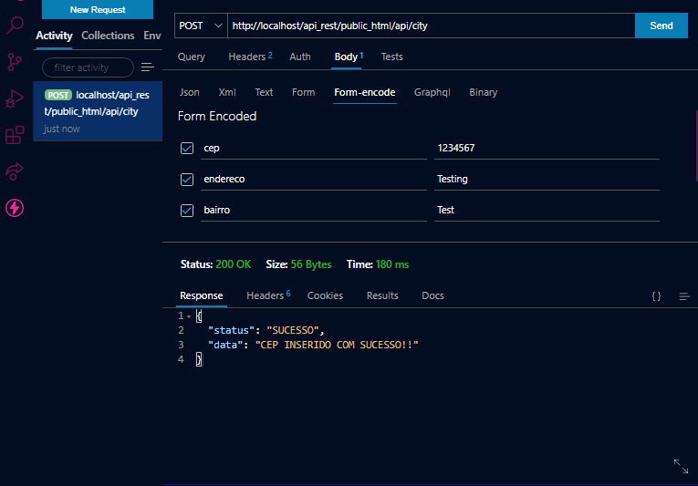

<h1>REST API - Search and address register</h1>

<h1>About</h1>

• It's a public API made for me to complete a challenge, however, the project still needs some correction.

<h1>Tools</h1>

• HTML

• CSS

• PHP

• SQL

<h1>How to run</h1>

To run this project, you need to install XAMP or another server emulator, after this, execute the database and run the project from the root.

<h2>Search</h2>
<h3>To make a query, you need to access the URL where your project is located, in my case, it is this:</h3>

<h2>Insert</h2>
<h3>If you want to, you can also insert data. 
To do this, you must have ThunderClient or some other API'S program, and insert the values on the inputs as below</h3>
